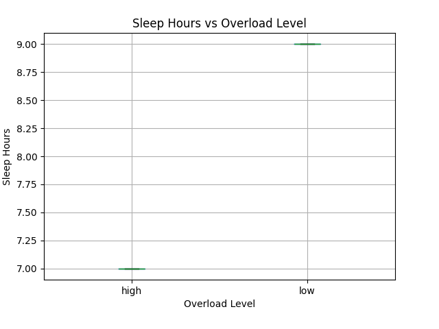
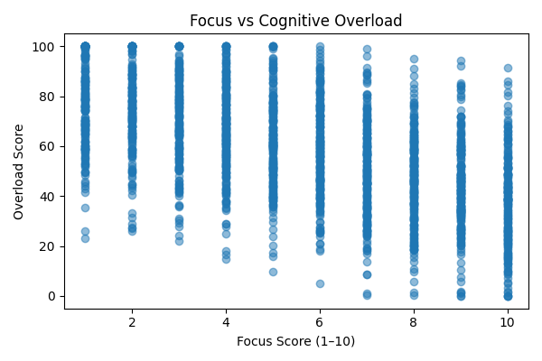

# 🧠 ADHD Cognitive Overload Predictor

(🔗 **Live App**: https://your-streamlit-link-here)

An end-to-end machine learning application that predicts **cognitive overload intensity** for individuals with ADHD using daily behavioral signals such as sleep, screen time, stress, task load, and focus.

The project demonstrates a full ML pipeline — from data generation and probabilistic labeling to regression modeling, explainability, and deployment via a Streamlit web app.

## Motivation & Problem Statement

Individuals with ADHD often experience **cognitive overload** — a state where mental demands exceed available cognitive resources. This overload is rarely caused by a single factor; instead, it emerges from the interaction of multiple daily variables such as sleep deprivation, excessive screen time, high stress, task switching, and reduced focus.

Most existing tools approach overload using **fixed rules or categorical thresholds**, which fail to capture the subjective, noisy, and human nature of mental fatigue.

This project explores a different approach:
- Treating cognitive overload as a **continuous signal**, not a rigid category
- Modeling overload in a **probabilistic, human-like way**
- Learning patterns from data rather than hard-coded logic

The goal is not clinical diagnosis, but **early awareness and self-reflection**, enabling individuals to better understand how daily behaviors contribute to mental overload.

## Dataset & Feature Space

Since real-world ADHD behavioral datasets are scarce and often sensitive, this project uses a **synthetically generated but cognitively grounded dataset** designed to mimic realistic daily patterns.

The dataset represents a single day per entry and consists of the following features:

- **Sleep Hours**: Total hours of sleep obtained the previous night  
- **Screen Time (hours)**: Time spent on digital screens during the day  
- **Stress Level (1–10)**: Self-reported perceived stress  
- **Task Count**: Number of cognitively demanding tasks handled  
- **Focus Score (1–10)**: Self-assessed ability to maintain focus  

These features were chosen because they reflect **well-studied contributors to cognitive fatigue and overload**, particularly in individuals with ADHD.

Rather than treating these variables in isolation, the model learns how their **combined interactions** influence overall mental load.

## Labeling Strategy: Modeling Cognitive Overload

Cognitive overload is inherently **subjective** — two individuals experiencing identical external conditions may report very different mental states. To reflect this reality, overload labels were **not computed using fixed rules or thresholds**.

Instead, this project adopts a **self-reported overload modeling approach**, where overload is treated as a **continuous variable** representing perceived cognitive strain.

The labeling process follows three key principles:

1. **Probabilistic Contribution**  
   Each behavioral feature contributes to overload with varying influence rather than deterministic weights.

2. **Controlled Noise Injection**  
   Randomness is intentionally introduced to simulate environmental factors, mood variability, and reporting bias — mimicking how humans actually perceive their day.

3. **Leakage Prevention**  
   The overload score is generated independently of the model training process, ensuring that no direct computation or rule-based shortcuts are present in the input features.

This strategy results in a more **human-like, non-robotic target signal**, allowing the regression model to learn meaningful patterns rather than memorizing formulas.

## Model & Training

Given that cognitive overload is modeled as a **continuous variable**, the problem is framed as a **regression task** rather than classification.

A tree-based regression model was trained to learn non-linear relationships between behavioral features and perceived overload intensity. This choice allows the model to capture interaction effects (e.g., low sleep combined with high stress) without requiring explicit rule definitions.

### Training Pipeline
- Input features: sleep hours, screen time, stress level, task count, focus score
- Target variable: continuous overload score
- Train–test split to evaluate generalization
- Model trained using standard regression loss optimization
- Final model persisted using `joblib` for deployment

The trained regressor is later loaded directly into the Streamlit application to provide real-time predictions.

## Evaluation Metrics

Since the task is regression-based, model performance is evaluated using continuous error metrics rather than accuracy.

- **Mean Absolute Error (MAE)**: Measures the average difference between predicted and self-reported overload scores.
- **Root Mean Squared Error (RMSE)**: Penalizes larger errors more strongly, indicating prediction stability.
- **R² Score**: Represents how much variance in perceived overload is explained by the model.

On the final test set, the model achieves:
- MAE ≈ 6–7 overload points
- RMSE ≈ 8
- R² ≈ 0.87

Given the subjective and noisy nature of self-reported mental states, these results indicate **strong and realistic predictive performance**.


## Feature Importance & Interpretability

To understand what the model learned, feature importance was extracted from the trained regression model.

Key observations:
- **Focus score and stress level** emerge as the strongest predictors, reflecting perceived control and emotional load.
- **Task count** contributes significantly, capturing cognitive demand.
- **Sleep and screen time** play supporting roles, influencing overload indirectly.

These results align with known cognitive and psychological patterns, reinforcing that the model learned **meaningful, human-aligned relationships** rather than artifacts.


## Visual Insights

To complement numerical metrics, several exploratory plots were generated using the final labeled dataset:

- Sleep Hours vs Overload Score  
- Screen Time vs Overload Score  
- Stress Level vs Overload Score  
- Task Count vs Overload Score  
- Focus Score vs Overload Score  

These visualizations demonstrate smooth, non-linear trends and validate both the labeling strategy and the model’s learned behavior.

Example plots:






## Streamlit Web Application

The trained model is integrated into an interactive **Streamlit web application** that allows users to input daily behavioral factors and receive:

- A predicted **cognitive overload score (0–100)**
- An interpreted overload level (Low / Moderate / High)
- Actionable, ADHD-friendly feedback

The app enables real-time self-reflection and demonstrates practical deployment of the trained ML model.


## How to Run Locally

1. Clone the repository:
   ```bash
   git clone https://github.com/<your-username>/ADHD-Overload-Predictor.git
